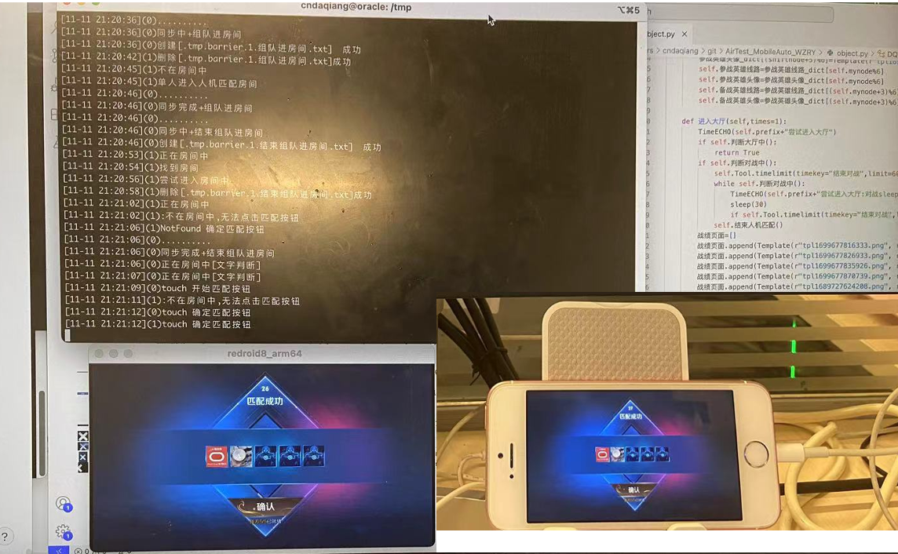

# AirTest_MobileAuto_WZRY

基于AirTest框架的面向对象的**多进程移动APP控制**

## 介绍

* 仅需替换`self.APPID`和`TASK=wzrj_task(self.移动端,"5v5匹配",0)`即可对新APP进行适配

### Features of AirTest_MobileAuto

#### 增强稳定性

* 连接状态检查
* 套壳AirTest函数, 多次运行失败则尝试重新连接而不是报错
* * 减少网络故障获取截图失败导致的程序终止. 
* * 极小概率有意外:ios有时需要重新插拔数据线才能`tidevice list`检测到设备.
* 全程自动运行, 无人值守. 检测到出错, 自动重启APP, 仍无法恢复则重启控制端(如docker、安卓模拟器)进行重置.
* 时间采用`UTC/GMT+08:00`, 方便根据中国游戏的任务刷新时间执行脚本
* 格式化输出`[%m-%d %H:%M:%S]+info`

#### 设备管理模块 `deviceOB`

* 面向对象: 传递对象, 各个模块应用统一进行设备管理
* 客户端: 
* - Android(手机, BlueStack for Windows, [docker](https://github.com/remote-android/) for Linux)
* - IOS(Iphone and Ipad with [WebDriverAgent(WDA)&tidevice](https://cndaqiang.github.io/2023/11/10/MobileAuto/))
* 控制端: Windows/Mac/Linux
* APP管理: 打开、关闭、重启
* 设备管理: 

|  客户端 | 控制端  | 客户端控制  |
| ------------ | ------------ | ------------ |
| BlueStack |  Windows | 打开、关闭、重启  |
| Docker  | Linux  | 打开、关闭、重启  |
| IOS  | Mac  | tidevice重连、重启  |
| 远程Android  | Mac  | adb重新连接  |

#### 相关工具DQWheel

* 基于文件系统的多进程支持
* - 单脚本n进程`python -u object.py -n`
* - 多脚本n进程`python -u object.py i n`
* - 同步、广播
* 文件管理和变量存储读写
* 时间管理: 获取时间、计时
* 增强AirTest
* - 利用文件&字典进行存取图片坐标, 减少重复寻找元素坐标时间. 亦可用于选中特定位置(如王者荣耀英雄按熟练度排序选择熟练度最低的英雄的坐标)
* - 存在则点击, 不断存在点击等

## 运行方式

### 通用多账户版本(需要adb、python、终端基础)
* [下载最最新代码](https://github.com/cndaqiang/AirTest_MobileAuto_WZRY)
* 修改代码中客户端的ip地址`auto_airtest>LINK_dict[i]=`
* [控制端、客户端配置](https://github.com/cndaqiang/AirTest_MobileAuto_WZRY/blob/master/howtorun.md)
* [其他参考资料](https://cndaqiang.github.io/2023/11/10/MobileAuto/)

### 简易单账户版本(需要安卓adb基础)

* 重装了Windows系统, 记录了全新安装python+雷电模拟器使用本脚本控制王者荣耀的详细过程[Windows全新安装python、依赖+雷电模拟器](https://github.com/cndaqiang/AirTest_MobileAuto_WZRY/issues/5#issuecomment-1901771876)
* [图形化控制单台小米手机示例](https://github.com/cndaqiang/AirTest_MobileAuto_WZRY/issues/5#issuecomment-1890969863)
* [全终端控制单台小米手机示例](https://github.com/cndaqiang/AirTest_MobileAuto_WZRY/issues/5#issuecomment-1890967828)

## 开发实例: 王者荣耀脚本

使用MacOS系统控制Iphone和Andriod容器进行组队人机对战

### Features

* 全部自动化操作
* - 自动开关机
* - 自动切换对战
* - 自动组队.(现在通过房主和其他账户建立友情关系, 利用友情关系自动进入房主账户)
* - 自动领礼包
* - 出错自动同步
* - 健康系统自动休息启动
* 创建文件控制已有脚本的运行方式[实例](https://github.com/cndaqiang/AirTest_MobileAuto_WZRY/issues/3)
* - 控制程序暂停、终止、对战模式
* - 永久/暂时替换对战英雄
* - 直接插入代码运行

### 礼包

* 友情对战: 友情币领取、奖励兑换(积分夺宝券、皮肤碎片、英雄碎片、友情重燃皮肤礼包、铭文碎片)
* 邮件礼包: 好友邮件、系统邮件
* 妲己一键领奖
* ~~日常任务礼包(2024赛年每日礼包转移至战令系统)~~
* 战令礼包、战令任务礼包(2024赛年)
* KPL观赛战令自动观赛领取经验升级
* 战队商店自动领取英雄碎片
* 商城每日免费钻石碎片随机礼包
* 王者营地: 体验服兑换碎片礼包、每日签到、每日任务、营地币每周兑换英雄碎片
* 玉镖夺魁自动领每日两个飞镖, 后面可以自己换积分夺宝券

### 对战

* 自动切换组队与单人模式、对战方式、对战模式等
* 常规5v5人机匹配(优先星耀其次青铜), 适合完成每日任务和提高熟练度, 对战每次可以获取金币和王者等级经验
* 模拟人手(移动+平A)进行标准/快速的青铜5v5模式, 每日会自动进行几次, 适合完成活动的*标准对战非挂机*条件.  此外模拟人手+快速对战对战胜利几率低, 不适合刷英雄熟练度, 但是不挂机能获得更多的金币奖励
* 王者模拟战, 刷信誉分专用, 每日5分. 站令的每期任务:20场娱乐模式, 可以用模拟战刷齐
* ~~冒险模式(2024赛年官方关闭入口/功能): 武道大会、六国远征. 额外的金币上限、商店兑换~~
* `使用savepos=True`可以把英雄图像选为最后一个, 并把英雄按照熟练度排序, 即可不断提高最低英雄的熟练度

### 文件控制

- 控制文件 `txt` 不参与仓库同步, 使用[实例](https://github.com/cndaqiang/AirTest_MobileAuto_WZRY/issues/3)
- **注：所有文件都默认采用UTF8格式编码**

| 文件  | 功能  | 备注  |
| :------------: | :------------: | :------------: |
| `self.结束游戏FILE="WZRY.ENDGAME.txt"` | 本局结束后关闭WZRYAPP, 同时结束对战循环  | 用户创建  |
| `self.SLEEPFILE="WZRY.SLEEP.txt"` |  本局结束后 `sleep(5min)` 直到该文件被删除, 用于暂停代码, 手动进行抽奖领礼包  | 用户创建   |
| `self.触摸对战FILE="WZRY.TOUCH.txt"` |在对战过程中尝试移动英雄和平A, 通过非挂机的检测判断金币更多. 注: 若前两行存在数字，则移动方向为对应数字 |用户创建 |
| `self.标准模式触摸对战FILE="WZRY.标准模式TOUCH.txt" ` |使用标准模式对战, 并在对战过程中尝试移动英雄和平A, 用于满足一些任务对标准人机对战非挂机的检测判断 |用户创建 |
| `self.临时组队FILE="WZRY.组队.txt"` | 仅适用于并行组队模式, 现在代码中组队模式仅在每天的前几个小时, 后面如果还想组队又不想重跑程序，可以通过创建该文件恢复组队模式| 用户创建|
| `self.无法进行组队FILE = f"WZRY.无法进行组队FILE.txt"` | 仅适用于并行组队模式, 如果某个账户被顶掉, 则关闭组队功能| 程序自动生成删除/用户创建删除|
| `self.青铜段位FILE = f"WZRY.{self.mynode}.青铜段位.txt"` | 存在则进行青铜人机, 不存在则进行星耀人机|程序自动生成/用户创建
| `self.标准模式FILE = f"WZRY.{self.mynode}.标准模式.txt"` | 存在则进行标准人机, 不存在则进行快速人机|用户创建
| `self.临时初始化FILE = f"WZRY.{self.mynode}.临时初始化.txt"` | 仅适用于王者荣耀循环对战的开头插入任意自己想添加的代码, 例如更新图片的定义如`self.图片 = wzry_figure(prefix=self.prefix, Tool=self.Tool)`. 亦可在这里强制进行一些计算| 用户创建|
| `self.对战前插入FILE = f"WZRY.{self.mynode}.对战前插入.txt"` | 在对战循环前再次修改配置, 初始化和对战前还是会自动计算相关参数, 这里强制覆盖提高自由度| 用户创建|
| `self.重新设置英雄FILE=f"WZRY.{self.mynode}.重新设置英雄.txt"` |不修改代码和重启程序, 修改对战过程中使用的英雄, 内容见 `WZRY.node.重新设置英雄.py` , 通过控制 `savepos` 来决定是否更新字典  |用户创建 |
| `sself.重新登录FILE = f"WZRY.{self.mynode}.重新登录FILE.txt"` |因为各种原因账户退出后, 程序自动创建, 若存在该文件则等待10min, 直到用户删除 |程序自动生成删除/用户创建删除 |
| `var_dict_file=f"{self.移动端.设备类型}.var_dict_{self.mynode}.txt"` | 存储很多图片坐标点的文件, 减少图片识别时间, 删除后重新识别 | 程序自动生成|
| `self.prefix+"六国远征.txt"` |每日自动创建, 如存在该文件则进行相关计算, 计算完成后删除该文件|程序自动生成/用户创建
| `self.prefix+"武道大会.txt"` |每日自动创建, 如存在该文件则进行相关计算, 计算完成后删除该文件|程序自动生成/用户创建
| `self.玉镖夺魁签到=os.path.exists("玉镖夺魁签到.txt")` |是否进行玉镖夺魁, 定期的活动|程序自动生成/用户创建
| `self.免费商城礼包FILE = f"WZRY.{self.mynode}.免费商城礼包.txt"` |是否领取每日的免费商城礼包, 领完删除|程序自动生成删除/用户创建
| `self.KPL每日观赛FILE = f"WZRY.KPL每日观赛FILE.txt"` | 存在则在礼包结束后进行KPL观赛并领取赛事战令经验, 刷KPL战令, 可将数字填入该文件定义观赛时长 | 程序自动生成
| `NeedRebarrier.txt` |多进程运行时, 强制跳过当前所有任务, 进行统一的barrier. 即使多进程模式已经处于独立组队模式，这一文件也强制让所有进程进行一次barrier|程序出错自动生成/用户创建|
| `self.prefix+"NeedRebarrier.txt"` |本进程跳过所有任务, 回到循环开头, 重新初始化 |  程序出错自动生成/用户创建 |
| `self.WZRYPIDFILE = f"WZRY.{self.mynode}.PID.txt"` |给本次运行的进程定义一个ID, 如果有新的进程也操纵这个设备, 则结束本进程 |程序自动生成|
| `self.独立同步文件 = self.prefix+"NeedRebarrier.txt"` | 同步工具, 单个进程出错重新初始化 | 程序自动生成/用户创建
|`self.图片更新FILE = "WZRY.图片更新.txt"`| 王者特殊活动时,大厅、对战、开始游戏等按钮会发生变化,用此文件更新，你可以按照自己[修改图标](https://github.com/cndaqiang/AirTest_MobileAuto_WZRY/issues/3#issuecomment-1926446059),我在一些活动时也会[更新图标](https://github.com/cndaqiang/AirTest_MobileAuto_WZRY/issues/8) | 用户创建|
| `self.辅助同步文件 = "NeedRebarrier.txt"` | 同步工具, 单个进程出错创建所有进程重新初始化 | 程序自动生成/用户创建
| `self.营地初始化FILE=prefix+".初始化.txt"=(mynode)王者营地.初始化.txt` | 王者营地领取礼物前注入代码, 适合临时活动[修改图标](https://github.com/cndaqiang/AirTest_MobileAuto_WZRY/issues/3#issuecomment-1926446059)| 用户创建
| `self.营地需要登录FILE = prefix+".营地需要登录.txt"` | 营地账户推出后生成, 存在次文件不领取营地礼包 | 程序自动生成删除/用户创建删除
| `self.prefix+"重新登录体验服.txt"` | 营地需要定期重新登录才可以兑换礼包| 程序生成, 用户删除|

### 备注

* 双号组队每周金币获取上限约9105
* - 5v5和模拟战共用金币上限(0/4100)
* - ~~六国远征、武道大会的金币不受前面限制平均(`(10个*6国*4次+5个*10局大会)*7天~2030`)~~
* - 每日礼包(`挑战35*5*7+日任务150*7+周任务700~2975`)
* 如何快速获取货币:
* - ~~六国远征、武道大会速度最快~~
* - 触摸形式的5v5人机耗时但是金币也远大于挂机
* - 模拟战也出现过即使最后一名, 金币也很多的情况
* 模拟战等模式账户之前没有进行过/新赛季, 自己提前操作一下, 避免有变动
* 自己手打能力测试时, 胜利/金牌可以获得600金币.
* * 胜利方式: 选英雄走游走, 出肉. 刷阵营, 让对吗中路游走是奕星. 张良等弱势英雄, 对面不能有控制.
* * 对战难度是最近两个赛季的最高段位, 所以掉段位后手打

## 致谢

本脚本大量参考了[WZRY_AirtestIDE@XRSec](https://github.com/XRSec/WZRY_AirtestIDE)项目, 是我学习AirTest脚本的主要参考.

本脚本的历史版本[WZRY_AirtestIDE_XiaoMi11@cndaqiang](https://github.com/cndaqiang/WZRY_AirtestIDE_XiaoMi11), [WZRY_AirtestIDE_emulator@cndaqiang](https://github.com/cndaqiang/WZRY_AirtestIDE_emulator)

## Star History

