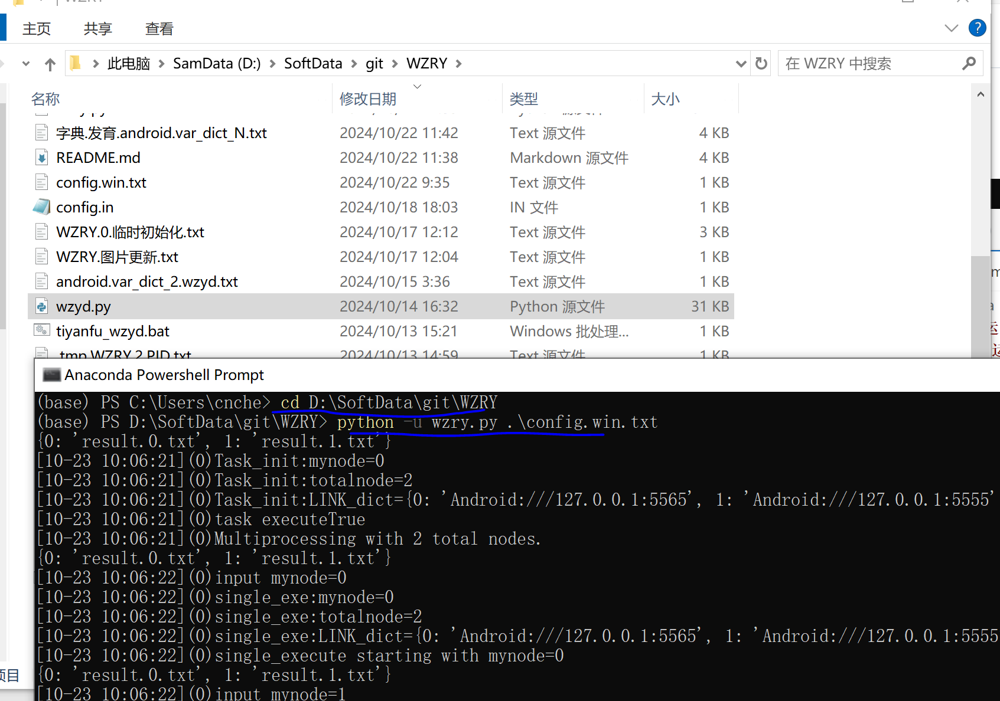

# 运行方法
如果你在运行时遇到问题
* 可以先在[常见问题收录](https://github.com/cndaqiang/WZRY/issues/42)中查找
* 其次认真阅读本说明
* 其实你读读源码`wzry.py`能解决你99%的问题
* 友善的提出问题[issues](https://github.com/cndaqiang/WZRY/issues)。
* * 附上**执行结果、配置文件、运行目录、游戏页面、模拟器设置页面、cmd/powershell/terminal/vscode/pycharm等运行界面截图**，
* * **@cndaqiang或者为项目start加速解决问题的速度。**
* * 请遵守[提问的礼仪](https://github.com/tvvocold/How-To-Ask-Questions-The-Smart-Way)。没人理会你的傲慢和懒惰。

## 准备工作
* 阅读初阶教程[WZRY.pdf](doc/WZRY.pdf)
* 从Releases页面[下载**最新**代码](https://github.com/cndaqiang/WZRY/releases),不要在Code页面点击下载
* **WZRY有特殊活动(比如周年庆)时，可以看看我是否提供了**[资源更新包](https://github.com/cndaqiang/WZRY/issues/8)。
* * 等不急更新的，可以自己使用AirTestIDE修改对应的图片。
* 升级依赖

```
python -m pip install -r requirements.txt -i https://pypi.tuna.tsinghua.edu.cn/simple  --upgrade
```


## 开启模拟器/手机的ADB调试。
* 本脚本测试通过的[模拟器推荐](https://github.com/cndaqiang/WZRY/issues/23)
* 模拟器的分辨率设置为`960x540`,`dpi=160`。其他分辨率可以运行，但不保证效果。


## 运行方式

### 终端运行

```
python -u wzry.py 配置文件
```

* 其中**配置文件**可以不写，但是不能乱写。(ps. 这里的**配置文件**是个文件，不是复制配置文件这几个字)
* 不指定配置文件时，即直接**运行`python wzry.py`**，默认单进程控制 `127.0.0.1:5555` 的安卓设备
* 如果要自己写配置文件，复制`example/config.in`到`config.win.txt`,修改后**运行`python wzry.py config.win.txt`**
* 下面是一些配置文件示例，足够应对各种情况。

⭐⭐**初次写配置文件，就用这个，适合控制一个账户**

```
[client]
LINK_dict = {
    0: "Android:///127.0.0.1:5555"}
```

⭐⭐**初次尝试组队，就用这个，适合控制两个账户**

```
[client]
totalnode = 2
multiprocessing = True
LINK_dict = {
    0: "Android:///127.0.0.1:5555",
    1: "Android:///127.0.0.1:5565"}
```

**更多配置示例**[usb调试、雷电模拟器、MuMu模拟器、BlueStacks](doc/config.example.md)

#### 这是我在windows上的配置信息及解释
* 终端Anaconda Powershell Prompt
* 运行脚本

* 配置文件说明


### 使用vscode/pycharm等软件运行
修改`wzry.py`中的`config_file = ""`为`config_file = "你的配置文件"`，例如


## 老手可以尝试开启的功能
* **通过在代码目录创建一些文件来精细的操作代码的运行**
* **所有文件都放在`wzry.py`所在路径，采用txt结尾，UTF8格式编码**，

**控制文件**
* `WZRY.oneday.txt`  # 今天执行完之后，直接退出程序。里面记录了总对局数。
* `WZRY.TOUCH.txt `  # 在5v5的对战过程中,移动和平A。通过活动的挂机检测。

**注入python命令**
* 标准的python语法，不支持超过一行的python语句。
* 替换`{self.mynode}`为配置文件中的编号，详见[常见问题](https://github.com/cndaqiang/WZRY/issues/42#issuecomment-2418500316)
* example目录有一些示例文件
* 在线示例[文件控制脚本功能](https://github.com/cndaqiang/WZRY/issues/13)
* `WZRY.{self.mynode}.临时初始化.txt`    # 控制脚本功能：运行时间、礼包等功能的开启关闭。
* `WZRY.{self.mynode}.对战前插入.txt`    # 控制对局过程：快速对战、标准对战、TOUCH模式、对战分路、对战英雄
* `WZRY.{self.mynode}.重新设置英雄.txt`  # 覆盖上面的设定，选择指定英雄


## 每天定时执行脚本
### windows平台的计划任务示例


### Linux计划任务示例
```
50 4 * * * pkill -f 'wzry.py'
51 4 * * * /usr/lib/android-sdk/platform-tools/adb kill-server
0 5 * * * cd /home/cndaqiang/soft/AirTest_MobileAuto_WZRY && /bin/bash run.sh
50 8 * * 1-5 pkill -f 'wzry.py'
```