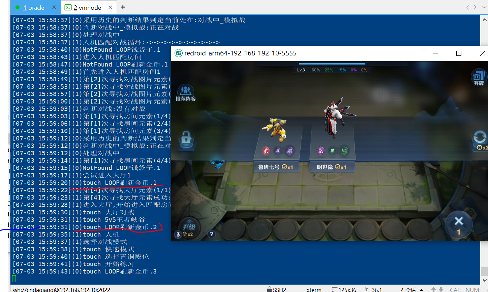

# 客户端推荐
windows模拟器
* [推荐]Bluestack, 目前支持打开关闭Bluestack更省电. 
* * 兼容hyper-v(Pie 64bit).  
* * [推荐]不兼容hyper-v的**Nougat模式**更省电，适合不用开wsl的笔记本, 而且adb的端口也不会变
* LDPlayer等模拟器
* * 目前通过`adb reboot`实现设备管理，还是费一点电

Linux 容器
* 使用[remote-android](https://github.com/remote-android/), 支持arm服务器

Mac未发现合适的

移动设备
* Android
* IOS(测试通过 15.8, 16.2)
* IOS端搭建和后续更新和学习AirTest也许会在这里[Android/IOS移动平台自动化脚本(基于AirTest)](https://cndaqiang.github.io/2023/11/10/MobileAuto/)


# 运行方法
* [下载最最新代码](https://github.com/cndaqiang/AirTest_MobileAuto_WZRY/releases)
* 如果你的默认设备不是`127.0.0.1:5555`,可以修改`object.py`中的`auto_airtest`函数中的`LINK_dict[0]=`，或者通过下面终端的方式指定手机的ip和端口

## 使用AirTest软件运行
* 下载地址[AirTest](https://airtest.netease.com/)
* 安装模拟器，并在模拟器上安装游戏APP，开启ADB调试，建议分辨率选960x540.
* * 其他分辨率本脚本也可以运行。
* 用AirTest直接打开object.py进点运行


## [推荐]使用命令行运行
### 控制端

测试稳定平台: Windows/MacOS/Linux(x86)/Linux(aarch64)

#### python依赖

```
python -m pip  install -i https://pypi.tuna.tsinghua.edu.cn/simple  airtest
python -m pip  install -i https://pypi.tuna.tsinghua.edu.cn/simple  pathos
```

#### 控制端的修改
Linux

```
sudo apt-get install libgl1-mesa-glx
```

Linux(ARM)

```
cndaqiang@oracle:~/.local/lib/python3.10/site-packages/airtest/core/android/static/adb/linux$ mv adb adb.bak
cndaqiang@oracle:~/.local/lib/python3.10/site-packages/airtest/core/android/static/adb/linux$ ln -s /usr/bin/adb .
```

Mac

```
chmod +x /Users/cndaqiang/anaconda3/lib/python3.11/site-packages/airtest/core/android/static/adb/mac/adb
```

#### [**可以不改**]代码修改
**20240702更新可以跳过此节**
* 本程序通过修改start(package="package")为start(package="package --put-syskeys 0")暂时解决了这个问题，可以不用修改代码, 但是建议修改

下面为历史信息：使用start_app启动安卓软件的各种坑
- 方式1(monkey). `start_app(package_name)`, 需要修改Airtest的代码添加`--pct-syskeys 0`
- 方式2(am start). `start_app(package_name, activity)`<br>
获得Activity的方法`adb -s 127.0.0.1:5565 shell dumpsys package com.tencent.tmgp.sgame`有一个Activity Resolver Table
<br> Airtest代码中是 `adb -s 127.0.0.1:5565  shell am start -n package_name/package_name.activity`
<br>可并不是所有的app的启动都遵循这一原则,所以如果相同方式2，还是要修改Airtest的代码，变为`package_name/activity`

* ~~本脚本已针对WZRY和WZYD，使用`start_app("com.tencent.gamehelper.smoba","","SGameActivity")`的方式打开程序，不会报错~~
* **综合上述原因，采取方式1**, 按照[https://cndaqiang.github.io/2023/11/10/MobileAuto/](https://cndaqiang.github.io/2023/11/10/MobileAuto/), 添加`--pct-syskeys 0`

### 使用终端运行
```
python -u object.py 2>&1 | tee result
```
指定设备运行
```
#无线ADB调试设备
python -u object.py "LINK=Android:///127.0.0.1:5555"
#usb直连的设备
python -u object.py "LINK=Android:///4e86ac13"
```

n个进程模式

```
python -u object.py -n 2>&1 | tee result
```

分散执行n进程模式(适合调试报错)

```
#每个终端执行
python -u object.py   0   n
python -u object.py   1   n
#...
python -u object.py (n-1) n
```
debug模式
```
python -u object.py n 1 # n > 4
```

# 文件控制
**通过在代码目录创建一些文件来动态调整代码的运行模式，可以实现自动切换分路、选择熟练度最低的英雄，进行王者模拟战等操作**

## 文件控制说明

- 控制文件 `txt` 不参与仓库同步, 使用[实例](https://github.com/cndaqiang/AirTest_MobileAuto_WZRY/issues/3)
- **注：所有文件都默认采用UTF8格式编码**

| 文件  | 功能  | 备注  |
| :------------: | :------------: | :------------: |
| `self.结束游戏FILE="WZRY.ENDGAME.txt"` | 本局结束后关闭WZRYAPP, 同时结束对战循环  | 用户创建  |
| `self.SLEEPFILE="WZRY.SLEEP.txt"` |  本局结束后 `sleep(5min)` 直到该文件被删除, 用于暂停代码, 手动进行抽奖领礼包  | 用户创建   |
| `self.触摸对战FILE="WZRY.TOUCH.txt"` |在对战过程中尝试移动英雄和平A, 通过非挂机的检测判断金币更多. 注: 若前两行存在数字，则移动方向为对应数字 |用户创建 |
| `self.标准模式触摸对战FILE="WZRY.标准模式TOUCH.txt" ` |使用标准模式对战, 并在对战过程中尝试移动英雄和平A, 用于满足一些任务对标准人机对战非挂机的检测判断 |用户创建 |
| `self.临时组队FILE="WZRY.组队.txt"` | 仅适用于并行组队模式, 现在代码中组队模式仅在每天的前几个小时, 后面如果还想组队又不想重跑程序，可以通过创建该文件恢复组队模式| 用户创建|
| `self.无法进行组队FILE = f"WZRY.无法进行组队FILE.txt"` | 仅适用于并行组队模式, 如果某个账户被顶掉, 则关闭组队功能| 程序自动生成删除/用户创建删除|
| `self.青铜段位FILE = f"WZRY.{self.mynode}.青铜段位.txt"` | 存在则进行青铜人机, 不存在则进行星耀人机|程序自动生成/用户创建
| `self.标准模式FILE = f"WZRY.{self.mynode}.标准模式.txt"` | 存在则进行标准人机, 不存在则进行快速人机|用户创建
| `self.临时初始化FILE = f"WZRY.{self.mynode}.临时初始化.txt"` | 仅适用于王者荣耀循环对战的开头插入任意自己想添加的代码, 例如更新图片的定义如`self.图片 = wzry_figure(prefix=self.prefix, Tool=self.Tool)`. 亦可在这里强制进行一些计算| 用户创建|
| `self.对战前插入FILE = f"WZRY.{self.mynode}.对战前插入.txt"` | 在对战循环前再次修改配置, 初始化和对战前还是会自动计算相关参数, 这里强制覆盖提高自由度| 用户创建|
| `self.重新设置英雄FILE=f"WZRY.{self.mynode}.重新设置英雄.txt"` |不修改代码和重启程序, 修改对战过程中使用的英雄, 内容见 `WZRY.node.重新设置英雄.py` , 通过控制 `savepos` 来决定是否更新字典  |用户创建 |
| `sself.重新登录FILE = f"WZRY.{self.mynode}.重新登录FILE.txt"` |因为各种原因账户退出后, 程序自动创建, 若存在该文件则等待10min, 直到用户删除 |程序自动生成删除/用户创建删除 |
| `var_dict_file=f"{self.移动端.设备类型}.var_dict_{self.mynode}.txt"` | 存储很多图片坐标点的文件, 减少图片识别时间, 删除后重新识别 | 程序自动生成|
| `self.prefix+"六国远征.txt"` |每日自动创建, 如存在该文件则进行相关计算, 计算完成后删除该文件|程序自动生成/用户创建
| `self.prefix+"武道大会.txt"` |每日自动创建, 如存在该文件则进行相关计算, 计算完成后删除该文件|程序自动生成/用户创建
| `self.玉镖夺魁签到=os.path.exists("玉镖夺魁签到.txt")` |是否进行玉镖夺魁, 定期的活动|程序自动生成/用户创建
| `self.免费商城礼包FILE = f"WZRY.{self.mynode}.免费商城礼包.txt"` |是否领取每日的免费商城礼包, 领完删除|程序自动生成删除/用户创建
| `self.KPL每日观赛FILE = f"WZRY.KPL每日观赛FILE.txt"` | 存在则在礼包结束后进行KPL观赛并领取赛事战令经验, 刷KPL战令, 可将数字填入该文件定义观赛时长 | 程序自动生成
| `NeedRebarrier.txt` |多进程运行时, 强制跳过当前所有任务, 进行统一的barrier. 即使多进程模式已经处于独立组队模式，这一文件也强制让所有进程进行一次barrier|程序出错自动生成/用户创建|
| `self.prefix+"NeedRebarrier.txt"` |本进程跳过所有任务, 回到循环开头, 重新初始化 |  程序出错自动生成/用户创建 |
| `self.WZRYPIDFILE = f"WZRY.{self.mynode}.PID.txt"` |给本次运行的进程定义一个ID, 如果有新的进程也操纵这个设备, 则结束本进程 |程序自动生成|
| `self.独立同步文件 = self.prefix+"NeedRebarrier.txt"` | 同步工具, 单个进程出错重新初始化 | 程序自动生成/用户创建
|`self.图片更新FILE = "WZRY.图片更新.txt"`| 王者特殊活动时,大厅、对战、开始游戏等按钮会发生变化,用此文件更新，你可以按照自己[修改图标](https://github.com/cndaqiang/AirTest_MobileAuto_WZRY/issues/3#issuecomment-1926446059),我在一些活动时也会[更新图标](https://github.com/cndaqiang/AirTest_MobileAuto_WZRY/issues/8) | 用户创建|
| `self.辅助同步文件 = "NeedRebarrier.txt"` | 同步工具, 单个进程出错创建所有进程重新初始化 | 程序自动生成/用户创建
| `self.营地初始化FILE=prefix+".初始化.txt"=(mynode)王者营地.初始化.txt` | 王者营地领取礼物前注入代码, 适合临时活动[修改图标](https://github.com/cndaqiang/AirTest_MobileAuto_WZRY/issues/3#issuecomment-1926446059)| 用户创建
| `self.营地需要登录FILE = prefix+".营地需要登录.txt"` | 营地账户推出后生成, 存在次文件不领取营地礼包 | 程序自动生成删除/用户创建删除
| `self.prefix+"重新登录体验服.txt"` | 营地需要定期重新登录才可以兑换礼包| 程序生成, 用户删除|


### 文件控制运行示例
[文件控制脚本功能](https://github.com/cndaqiang/AirTest_MobileAuto_WZRY/issues/13)


# 备注
## 刷王者的一些经验

* 双号组队每周金币获取上限约9105
* - 5v5和模拟战共用金币上限(0/4100)
* - ~~六国远征、武道大会的金币不受前面限制平均(`(10个*6国*4次+5个*10局大会)*7天~2030`)~~
* - 每日礼包(`挑战35*5*7+日任务150*7+周任务700~2975`)
* - 信誉分影响金币上限
* 如何快速获取货币:
* - ~~六国远征、武道大会速度最快~~
* - 触摸形式的5v5人机耗时但是金币也远大于挂机
* - 模拟战也出现过即使最后一名, 金币也很多的情况
* 模拟战等模式账户之前没有进行过/新赛季, 自己提前操作一下, 避免有变动
* 自己手打**能力测试**时, 胜利/金牌可以获得600金币.不受每周金币获取限制
* * 胜利方式: 选英雄走游走, 出肉. 刷阵营, 让对吗中路游走是奕星. 张良等弱势英雄, 对面不能有太多控制(甄姬).
* * 对战难度是最近两个赛季的最高段位, 所以掉段位后手打

## 一些调试截图
使用MacOS系统控制Iphone和Andriod容器进行组队人机对战


控制(0)账户进行模拟战,(1)账户正常5v5人机

