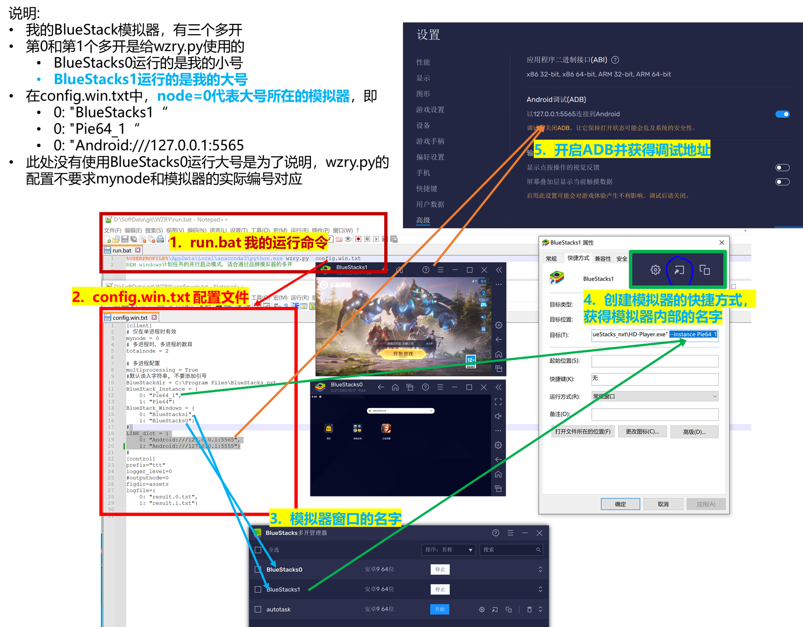
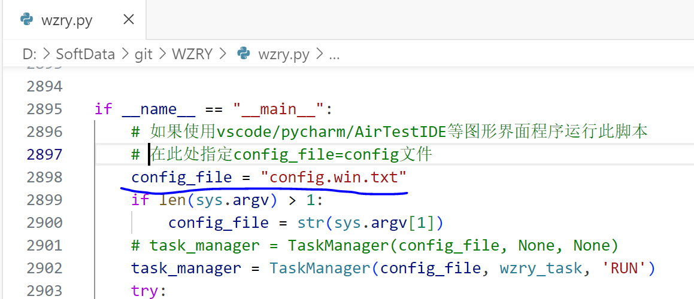

# 运行方法
如果你在运行时遇到问题
* 可以先在[常见问题收录](https://github.com/cndaqiang/WZRY/issues/42)中查找
* 其次认真阅读本说明
* 其实你读读源码`wzry.py`能解决你99%的问题
* 友善的提出问题[issues](https://github.com/cndaqiang/WZRY/issues)
* * 提问时，附上你的**执行结果、配置文件、运行目录、模拟器界面截图**，
* * **提问时@cndaqiang或者为项目start提醒我有人提问。**


## 准备工作

* 从Releases页面[下载**最新**代码](https://github.com/cndaqiang/WZRY/releases),不要在Code页面点击下载
* **WZRY有特殊活动(比如周年庆)时，可以看看我是否提供了**[资源更新包](https://github.com/cndaqiang/WZRY/issues/8)。
* * 等不急更新的，可以自己使用AirTestIDE修改对应的图片。
* 升级依赖

```
python -m pip install -r requirements.txt -i https://pypi.tuna.tsinghua.edu.cn/simple  --upgrade
```


## 开启模拟器/手机的ADB调试。
* 本脚本测试通过的[模拟器推荐](https://github.com/cndaqiang/WZRY/issues/23)
* 建议采用**`960x540`的分辨率`dpi=160`**，脚本内部有额外的加速命令
* * 该分辨率可以利用我的[example/字典.分路.android.var_dict_N.zip](example/字典.分路.android.var_dict_N.zip)进行加速
* * 即复制`字典.游走.android.var_dict_N.txt`为`android.var_dict_mynode.txt`(`mynode`默认是`0`,具体解释[13](https://github.com/cndaqiang/WZRY/issues/13#issue-2381467976))
* * 以及[自动调整分路并选择熟练度最低的英雄](https://github.com/cndaqiang/WZRY/issues/13#issuecomment-2205392546)。
* 其他分辨率也可以运行，代码会自动生成你的字典文件`android.var_dict_mynode.txt`，执行速度会越来越快。
* * 但是有些活动图标在不同的分辨率上显示效果不同，可能无法识别成功，需要你使用AirTestIDE修改对应的图片。


## 运行方式

### 终端运行

```
python -u wzry.py 配置文件
```

* **其中配置文件可以省略，但是不能乱写**
* 不指定配置文件时，即直接**运行`python wzry.py`**，默认单进程控制 `127.0.0.1:5555` 的安卓设备
* 如果要自己写配置文件，复制`config.in`到`config.win.txt`,修改后**运行`python wzry.py config.win.txt`**
* * 下面是一些配置文件示例，足够应对各种情况。
* * 二次开发源码，可以阅读[airtest-mobileauto](https://pypi.org/project/airtest-mobileauto/)。

#### 控制一个模拟器/wifi连接的安卓手机上的王者账户[单人模式]
⭐⭐**新手初次写配置文件，就用这个，适合控制一个账户**

```
[client]
LINK_dict = {
    0: "Android:///127.0.0.1:5555"}
```

#### 控制两个安卓设备上的王者账户组队[双人组队模式]
⭐⭐**新手初次尝试组队，就用这个，适合控制两个账户**

```
[client]
totalnode = 2
multiprocessing = True
LINK_dict = {
    0: "Android:///127.0.0.1:5555",
    1: "Android:///127.0.0.1:5565"}
```

#### 这是我在windows上的配置信息及解释
* 新手初次尝试控制虚拟机的开关机组队可以参考
[/BlueStack多开示例.pptx](doc/BlueStack多开示例.pptx)


#### 更多配置示例
* [usb调试、雷电模拟器、MuMu模拟器、BlueStacks](doc/config.example.md)

### 使用vscode/pycharm等软件运行
修改`wzry.py`中的`config_file = ""`为`config_file = "你的配置文件"`，例如



# 高级功能
* **通过在代码目录创建一些文件来动态调整代码的运行模式，可以实现自动切换分路、选择熟练度最低的英雄，进行王者模拟战等操作**
* 控制文件 `txt` 不参与仓库同步, [文件控制运行示例](https://github.com/cndaqiang/WZRY/issues/13)
* **注：所有文件都默认采用UTF8格式编码**
* 以最新代码为准, 下面的内容仅供参考。


## 控制文件
* 存在下面的文件则开启相应的功能
```
self.只战一天FILE = "WZRY.oneday.txt"  # 今天执行完之后，直接结束程序。适用采用crontab/Windows计划任务控制每天固定时间启动本脚本。
self.今日休战FILE = "WZRY.tomorrow.txt"  # 今天不打了，明天开始，适合于离开办公室时运行脚本，但是不要执行任何命令，明天早上开始执行。
self.触摸对战FILE = "WZRY.TOUCH.txt"  # 在5v5的对战过程中,自动移动和平A,提高金币数量和通过挂机检测。
self.标准模式FILE = f"WZRY.{self.mynode}.标准模式.txt"  # 使用5v5标准对战模式
self.临时组队FILE = "WZRY.组队.txt" # 在组队时间外组队
self.玉镖夺魁签到FILE = "玉镖夺魁签到.txt" 
self.免费商城礼包FILE = f"WZRY.{self.mynode}.免费商城礼包.txt"  # 领每日商城礼包
self.KPL每日观赛FILE = f"WZRY.KPL每日观赛FILE.txt"
self.更新体验服FILE = f"WZRY.{self.mynode}.更新体验服.txt"  # 登录体验服领取体验币
```

## 注入命令
* 将python指令填写到下面的文件中，直接修改程序的运行
* 替换`{self.mynode}`为配置文件中的编号.
* 示例example目录
* 在线示例[文件控制脚本功能](https://github.com/cndaqiang/WZRY/issues/13)

```
self.重新设置英雄FILE = f"WZRY.{self.mynode}.重新设置英雄.txt"
self.临时初始化FILE = f"WZRY.{self.mynode}.临时初始化.txt"
self.对战前插入FILE = f"WZRY.{self.mynode}.对战前插入.txt"
```

## 更新资源
```
self.图片更新FILE = "WZRY.图片更新.txt"
```


# 其他补充
## 关于windows平台的计划任务
* [**推荐**]`只在用户登录时运行`
* * 启动脚本时会跳出窗口，可以自动打开模拟器,和正常执行脚本相同。
* * 锁屏之后还可以执行，可以正常启动模拟器 
* `不管用户是否登录都要运行`
* * 需要输入密码，启动脚本时不会跳出窗口，可以自动打开模拟器。
* * 多开器，和用户界面以及任务管理器无论怎么找都找不到模拟器的进程。无法限制模拟器只用的资源。
* * 脚本和其他ADB工具可以调试这些隐藏的模拟器。

### 配置示例


## Linux计划任务示例
```
50 4 * * * pkill -f 'wzry.py'
51 4 * * * /usr/lib/android-sdk/platform-tools/adb kill-server
0 5 * * * cd /home/cndaqiang/soft/AirTest_MobileAuto_WZRY && /bin/bash run.sh
50 8 * * 1-5 pkill -f 'wzry.py'
```